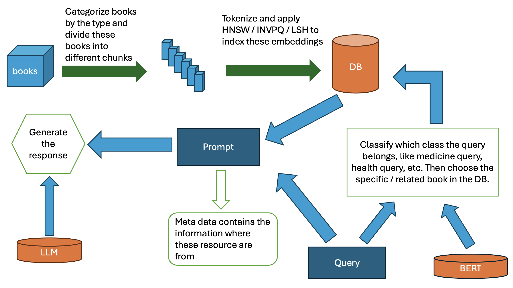
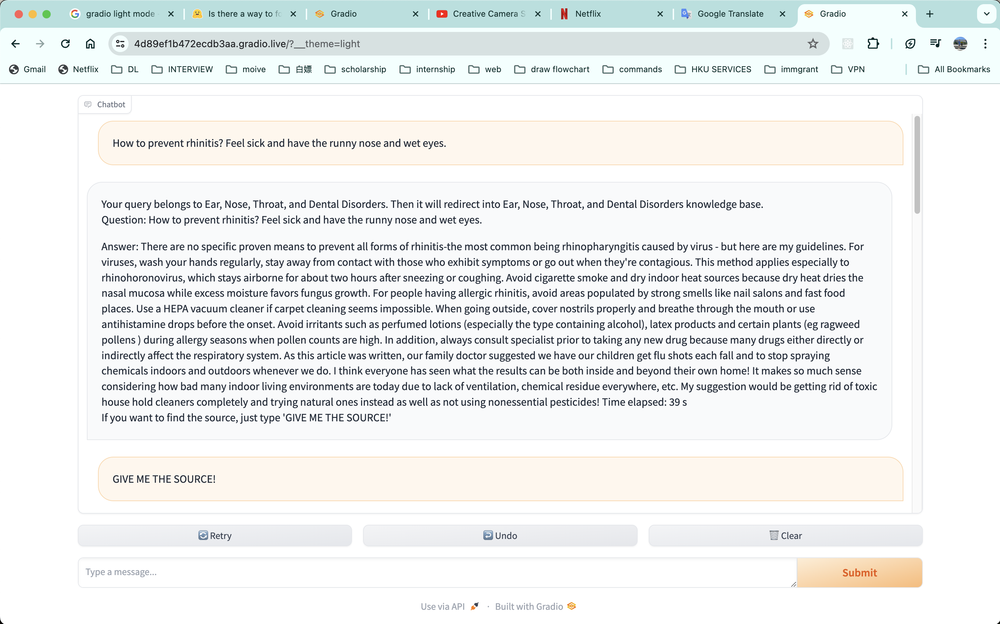
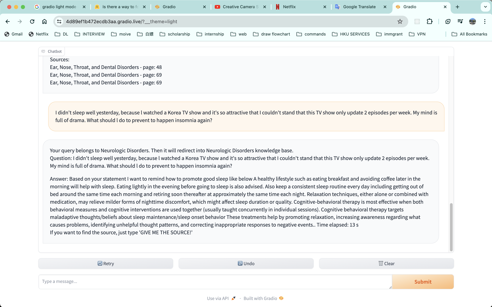

### Chatbot using few shot learning adapts different domains.

This project aims to build a chatbot that can adapts in the different domains, which means that as long as we have some text in specific domains, you can deploy it easily. To speed up the retrieval process, we can train a light model (like RoBerta) to classify which domain this text is in. What's more, we can also retrieve the source of data, like the page, book name, by just typing "GIVE ME THE SOURCE".

### Workflow:

1.Collect lots of different kinds of professional books, categorize these books based on these chapters, and split these text into equal sized text.

2.Train a text classification model

1.Use embedding model (like BGE, all-MiniLM) to generate the embedding of these split text and save them into DB by utilizing LSH / KNSW/ IVFPQ index to accelerate the process of searching. 

2.Collect lots of queries, apply them by using embedding model to get the embeddings, and find the category of nearest K texts in the DB.

3.Choose the most voted category as the query’s category (label), so we get the query-label data pair.

4.Train a text classification light model that predicts which category this query belongs to. 

3.Infer the answer

1.Use model from step 2 to generate the category, then find the most likely/similar M texts in the predicted domain DB.

2.Generate the prompt by using these M text chunks.

3.Feed the prompt to generate the answer.

4.The chatbot can also output relevant data sources, such as which page of which book.

The whole workflow diagram is as follows:



To boost the chatbot, just execute:

```shell
python chatbot.py
```

The final finished product picture are as follows:



