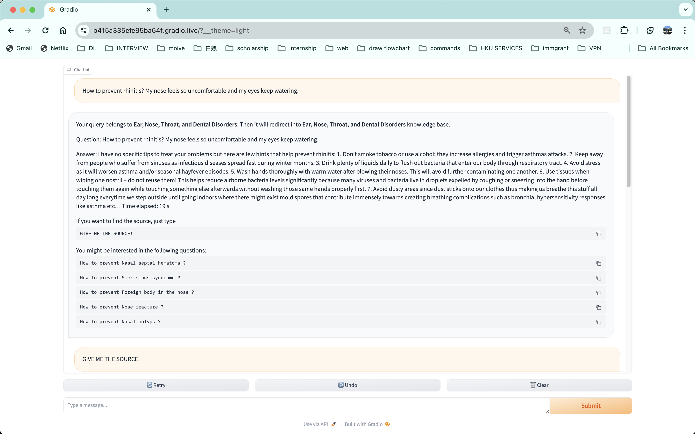
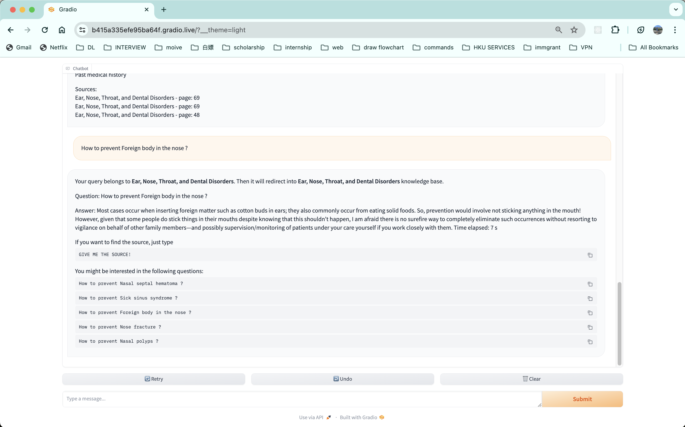

### Chatbot using few shot learning adapts different domains.

This project aims to build a chatbot that can adapts in the different domains, which means that as long as we have some text in specific domains, you can deploy it easily. To speed up the retrieval process, we can train a light model (like RoBerta) to classify which domain this text is in. What's more, we can also retrieve the source of data, like the page, book name, by just typing "GIVE ME THE SOURCE". Last but not least, chatbot could predict the next few questions that user want to ask.

### Workflow:

1. Acquire a diverse collection of professional corpus, categorize them by chapter, and split them into uniform texts with equal size.

2. Develop a text classification model

   1. Embed the processed structured data with embedding models like BGE and all-MiniLM , store them into a DB accelerated by retrieving techniques like LSH, KNSW, IVFPQ.

   2. Gather a broad set of queries, generate embeddings for them using the same embedding model, and identify the category of the closest K texts in the DB.

   3. Choose the category with most votes to label the query, creating a query-label pair.

   4. Train a lightweight text classification model that predicts the category to which the given query belongs. 

3. Inference

   1. Use the text classification model from step 2 to determine the category, then find M most similar texts in the target domain DB.

   2. Compile these M texts to construct a prompt.

   3. Feed the prompt to generate the desired answer.

   4. The chatbot can also output relevant data sources, such as specific pages from the sourced books.

   5. The chatbot compares the embeddings of current query with the embeddings in the database and choose the most similar K questions as predicted next few questions.

The whole workflow diagram is as follows:


Firstly, you should train a text classification model by running the following command:

```
python text_classification/train.py
```


To boost the chatbot, just execute:

```shell
python chatbot.py
```

The final finished product picture are as follows:





