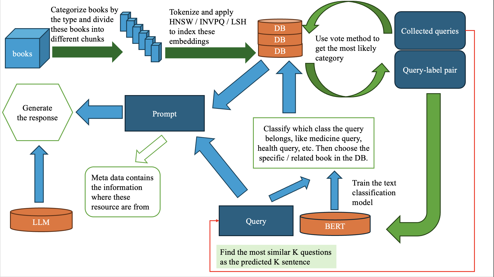

### Chatbot using few shot learning adapts different domains.

This project aims to build a chatbot that can adapts in the different domains, which means that as long as we have some text in specific domains, you can deploy it easily. To speed up the retrieval process, we can train a light model (like RoBerta) to classify which domain this text is in. What's more, we can also retrieve the source of data, like the page, book name, by just typing "GIVE ME THE SOURCE".

The whole workflow is as follows:



To boost the chatbot, just execute:

```shell
python chatbot.py
```

The final finished product picture are as follows:


